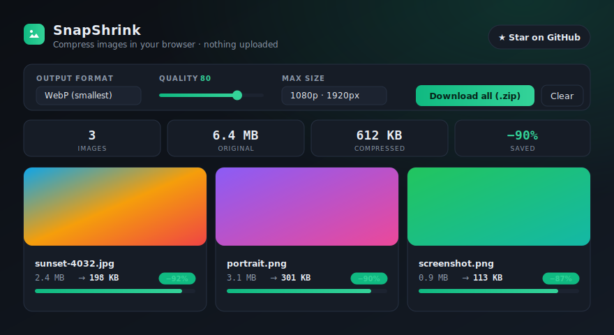

<div align="center">

# 🔒 SnapShrink

**Compress, resize & convert images — 100% in your browser.**

No uploads. No servers. No tracking. Your images never leave your device.

[**▶ Live demo**](https://czarpixels.github.io/snapshrink/) · [Report a bug](https://github.com/Czarpixels/snapshrink/issues) · MIT licensed



</div>

---

## Why

Most "free image compressors" upload your photos to some stranger's server. SnapShrink does the whole thing **locally** using the Canvas API — you can literally open DevTools ▸ Network and watch it make zero requests. Works offline. Nothing to install.

## Features

- 🗜️ **Real compression** — JPEG, WebP, PNG, and AVIF (where the browser supports it), with a live quality slider.
- 📐 **Resize on the way out** — cap the longest edge at 4K / 1080p / 800px, etc.
- 🖼️ **Batch it** — drag in a whole folder; every image processes in parallel and re-runs instantly when you tweak settings.
- 📦 **Download all as a `.zip`** — built with a tiny dependency-free ZIP writer ([`zip.js`](zip.js), ~130 lines).
- 🧭 **EXIF-aware** — respects photo orientation so nothing shows up sideways.
- 🧠 **Smart "keep original"** — if re-encoding would make a file *bigger*, it keeps the original bytes.
- 🌗 **Light & dark** — follows your system theme.
- 📄 **Zero dependencies** — plain HTML/CSS/JS. No build step, no `node_modules`.

## Run it

It's a static site — any of these work:

```bash
# Just open the file
open index.html            # macOS
start index.html           # Windows

# …or serve it (recommended, so createImageBitmap has a clean origin)
python -m http.server 8080
# then visit http://localhost:8080
```

## Deploy your own

It's a static site, so GitHub Pages serves it straight from the branch — no build:
**Settings ▸ Pages ▸ Source: "Deploy from a branch" ▸ `main` / `root`**. Your demo goes live at `https://<you>.github.io/snapshrink/`.

## How it works

```
File → createImageBitmap (EXIF-corrected)
     → <canvas> (optionally downscaled)
     → canvas.toBlob(mime, quality)
     → keep the smaller of {re-encoded, original}
```

Everything runs on the main thread with a debounced re-encode so dragging the quality slider feels instant. Big batches process sequentially to stay responsive.

## Browser support

Works in any modern browser (Chrome, Edge, Firefox, Safari). AVIF *output* needs Chrome/Edge 100+ — elsewhere SnapShrink automatically falls back to WebP.

## Contributing

[Issues](https://github.com/Czarpixels/snapshrink/issues) and PRs welcome. It's intentionally small and dependency-free — please keep it that way. Ideas: drag-to-compare before/after slider, PWA/offline caching, strip-metadata toggle, per-image quality overrides.

## License

[MIT](LICENSE) — do whatever you want.
